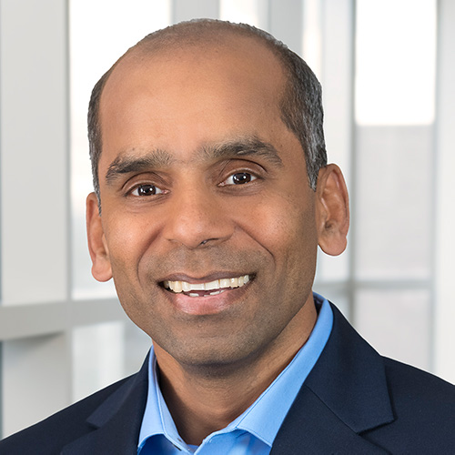

  
Arun Gupta

Vice President & General Manager Open Ecosystem Initiatives -
Intel

## Working in a team

Most work is done in a team, not by oneself.
With remote work, teams are becoming more spread out and diverse.
Soft skills can make the difference in reaching a goal.

### Soft Skills

aka **people** skills

Showing your personality.
Defining culture of organization.
_Hard to acquire_.

Technical skills -
What we do

Non-technical skills -
Who we are

Key Skills
- critical thinking
- emotional intelligence
- collaboration
**TODO** get the rest from the slide

### Acts of kindness & gratitude

Helping / complimenting somebody without expecting a return

Thankful appreciation of an act of kindness

Kindness can bring a team closer together, chemically.

Expressions of kindness & gratitude can help relieve pain and stress.

* Practice kindness
* Gratitude check-ins
* Spot recognition

**People** skills are hard, invest in them **equally**.

